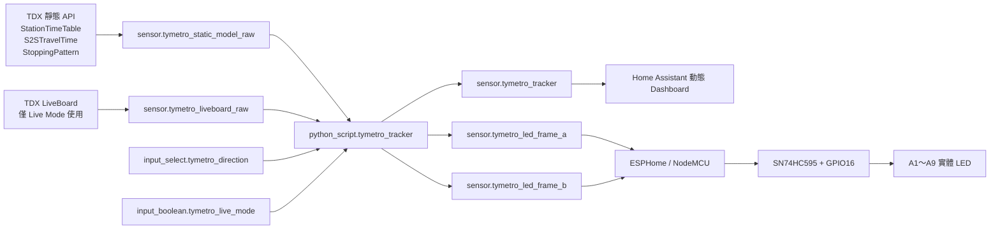

# TYMetro HA LED Tracker

一個以 **Home Assistant + ESPHome + ESP8266 + TDX** 製作的桃園機場捷運 A1～A9 實體列車位置顯示器。

這個專案同時包含：

- Home Assistant 內的列車時刻表軌跡模型
- TDX 官方捷運資料串接
- A1～A9 九顆實體 LED 顯示器
- ESPHome / NodeMCU 控制
- SN74HC595 移位暫存器
- 自訂 Home Assistant 動態 Dashboard
- 可選擇方向的列車位置模擬
- 可選的 TDX LiveBoard 即時校正

> **目前狀態（2026-08-22）：**  
> 以官方時刻表為基礎的 Schedule Tracker 已完成端到端驗證，可以自動從靜態資料建立列車軌跡，持續驅動 Home Assistant UI 與實體 A1～A9 LED。  
> TDX LiveBoard 即時資料擷取、過期資料判斷與 Schedule fallback 已完成；真正的 Live 列車 matching / delay correction 還需要等 TYMC 上游資料恢復正常更新後做最後實測。


---

## 專案在做什麼？

顯示範圍：

```text
A1 台北車站
   │
A2 三重
   │
A3 新北產業園區
   │
A4 新莊副都心
   │
A5 泰山
   │
A6 泰山貴和
   │
A7 體育大學
   │
A8 長庚醫院
   │
A9 林口
```

Home Assistant 會根據 TDX 官方時刻表與站間行車時間，建立列車在 A1～A9 區間的動態位置。

每一班列車會被表示成：

```text
列車種類
目前在哪一站 / 哪兩站之間
站間進度
行駛方向
是否套用 Live 即時校正
```

同一份列車模型會同時送到兩個輸出：

```text
                    ┌─→ Home Assistant 動態 Dashboard
列車位置模型 ───────┤
                    └─→ ESPHome → 實體 A1～A9 LED
```

因此 Dashboard 與實體 LED 使用的是同一套 canonical state，不會各自計算一套不同的列車位置。

---

# 目前已完成的功能

## 時刻表模式（Schedule Mode）

- [x] TDX OAuth Token
- [x] StationTimeTable
- [x] S2STravelTime
- [x] StoppingPattern
- [x] 普通車軌跡
- [x] 直達車軌跡
- [x] 直達車通過不停靠站的空間插值
- [x] A1 方向
- [x] A9 方向
- [x] 多班列車同時存在
- [x] 每 5 秒本機更新位置
- [x] Home Assistant 動態 UI
- [x] ESPHome Frame A / Frame B
- [x] 九顆實體 LED
- [x] 600 ms 本地 LED 動畫

## 即時模式（Live Mode）

- [x] Live Mode 開關
- [x] 每次最多 15 分鐘
- [x] 開啟後每 30 秒呼叫 TDX LiveBoard
- [x] LiveBoard 只保留 A1～A9 資料
- [x] `SrcUpdateTime` 新鮮度檢查
- [x] 過期資料自動退回 Schedule
- [x] Stale 狀態顯示
- [x] 40 秒 stale abort automation 已建立
- [ ] Fresh LiveBoard → Schedule train matching 最後實機驗證
- [ ] Realtime delay correction 最後實機驗證

---

# 系統架構



設計上刻意把責任切開：

### Home Assistant 負責

- TDX API
- OAuth
- JSON 資料
- 時刻表
- 普通 / 直達車
- 列車軌跡
- Live matching
- Frame A / Frame B

### ESP8266 負責

- 接收 Frame A / Frame B
- 每 600 ms 切換 frame
- 把 bitmask 轉成九顆 LED 的 ON / OFF

也就是：

> **Home Assistant 負責「列車在哪裡」；ESP8266 只負責「怎麼把位置快速穩定地亮出來」。**

完整設計請看：[docs/architecture.md](docs/architecture.md)

---

# 實體 LED 顯示器

這是本專案最直觀的部分。

目前實際完成的原型使用：

| 元件 | 數量 | 用途 |
|---|---:|---|
| NodeMCU v2 / ESP8266 | 1 | Wi-Fi、ESPHome、LED renderer |
| SN74HC595 | 1 | 將 3 條控制線擴充為 8 個 LED output |
| 紅色 LED | 9 | 分別代表 A1～A9 |
| 330 Ω 電阻 | 9 | 每顆 LED 各一顆限流電阻 |
| Breadboard | 1 | 原型接線 |
| Jumper wire | 多條 | 連接 NodeMCU / 595 / LED |
| USB | 1 | NodeMCU 供電 |

目前原型由 NodeMCU 的 `3V3` 與 `GND` 供應麵包板邏輯與 LED，沒有使用 MB102。

## 為什麼是 74HC595 + 一個 GPIO？

一顆 SN74HC595 剛好提供 8 個輸出：

```text
QA → A1
QB → A2
QC → A3
QD → A4
QE → A5
QF → A6
QG → A7
QH → A8
```

因此第九站 A9 直接使用 NodeMCU：

```text
D0 / GPIO16 → A9
```

NodeMCU 只需要：

```text
D7 / GPIO13 → DATA
D5 / GPIO14 → CLOCK
D6 / GPIO12 → LATCH
D0 / GPIO16 → A9
```

就能控制全部九顆 LED。

---

## LED 基本接法

每一顆 LED 都是：

```text
輸出
 │
 └──→ LED 長腳 / Anode (+)
          LED
       短腳 / Cathode (-)
             │
           330 Ω
             │
            GND
```

**每一顆 LED 都要有自己的 330 Ω 電阻。**

不要九顆 LED 共用一顆限流電阻。

---

## A1～A9 Breadboard 實際位置

目前驗證過的原型位置：

| 車站 | LED |
|---|---|
| A1 | E0 / E1 |
| A2 | E5 / E6 |
| A3 | E10 / E11 |
| A4 | E15 / E16 |
| A5 | E20 / E21 |
| A6 | E25 / E26 |
| A7 | E30 / E31 |
| A8 | E35 / E36 |
| A9 | E40 / E41 |

規則：

```text
前一格 = LED 長腳 / Anode
後一格 = LED 短腳 / Cathode
Cathode → 330 Ω → GND
```

詳細 SN74HC595 16-pin 接法、IC 方向、測試方式與故障排除：

**[docs/hardware.md](docs/hardware.md)**

LED Frame / 動畫設計：

**[docs/led-rendering.md](docs/led-rendering.md)**

---

# LED 如何表示「列車在兩站中間」？

LED 當然沒有辦法真的像螢幕一樣在 A5 與 A6 中間移動。

所以 Tracker 會產生兩個 frame：

```text
sensor.tymetro_led_frame_a
sensor.tymetro_led_frame_b
```

例如列車目前正在：

```text
A5 → A6
```

### 接近 A5

```text
Frame A = A5
Frame B = A5
```

因此 A5 穩定亮。

### 行駛到站間中段

```text
Frame A = A5
Frame B = A6
```

ESP8266 每 600 ms：

```text
A5 → A6 → A5 → A6 ...
```

視覺上就能理解為「列車正在 A5 / A6 之間」。

### 接近 A6

```text
Frame A = A6
Frame B = A6
```

A6 再次變成穩定亮。

這個動畫是在 ESP8266 本機完成，所以 Home Assistant 不需要每 600 ms 傳一次狀態。

---

# LED 位元遮罩（Bitmask）

Frame A / Frame B 都是 9-bit 整數：

```text
bit 0 = A1
bit 1 = A2
bit 2 = A3
bit 3 = A4
bit 4 = A5
bit 5 = A6
bit 6 = A7
bit 7 = A8
bit 8 = A9
```

例如：

```text
只有 A1            = 1
A1 + A3 + A5 + A8  = 149
A1～A9 全亮         = 511
```

多班列車同時存在時，所有列車佔用的 bit 會 OR 在一起。

---

# Home Assistant 動態介面

Home Assistant 使用自訂 Lovelace card：

```text
dashboard/tymetro-tracker-card.js
```

目前介面具有：

- A1～A9 單線軌道
- 普通 / 直達標示
- 真正的站間比例位置
- 每 5 秒資料更新之間的平滑動畫
- 多班列車接近時自動錯位
- 方向切換
- Live Mode
- Schedule / Live / Stale 狀態
- 列車進度
- 系統狀態

Dashboard 與 LED 不需要使用相同的視覺限制。

實體 LED 只有九個離散點；Dashboard 則可以直接用：

```text
position = from_station + progress × segment_length
```

畫出連續移動。

---

# 一般運作模式

## 時刻表模式（Schedule Mode）

```text
Live Mode = OFF
```

此時：

1. 不呼叫 LiveBoard。
2. 使用已取得的 TDX 官方靜態時刻表資料。
3. `TYMetro - Tracker Engine` 每 5 秒執行一次。
4. `tymetro_tracker.py` 重新計算 A1～A9 的列車位置。
5. 更新：
   - `sensor.tymetro_tracker`
   - `sensor.tymetro_led_frame_a`
   - `sensor.tymetro_led_frame_b`
6. Dashboard 更新。
7. ESPHome 接收 Frame。
8. 實體 LED 持續運作。

**每 5 秒更新列車位置不等於每 5 秒呼叫 TDX。**

Schedule 軌跡是 Home Assistant 本機運算。

---

# 靜態資料更新

目前 Static Model 會在：

```text
Home Assistant 啟動
每天 03:30
```

重新取得：

- `S2STravelTime`
- `StoppingPattern`
- A1 `StationTimeTable`
- A8 `StationTimeTable`

取得成功後，列車位置可以在 HA 本機自行計算。

目前 V1 的限制是：

> 如果 Home Assistant 在「完全沒有已載入 Static Model」的情況下冷啟動，而且 TDX Static API 剛好整體不可用，Tracker 暫時無法建立時刻表軌跡。

這與 LiveBoard 是否正常是兩回事。

詳細說明：[docs/reliability.md](docs/reliability.md)

---

# 即時模式（Live Mode）

Live Mode 是 **Schedule 的校正層**，不是另一套完全不同的定位系統。

原因是 TDX `LiveBoard/TYMC` 並不是 GPS train feed。

它主要提供的是：

```text
某站
某方向 / 目的地
預估幾分鐘後到站
資料更新時間
```

沒有可靠的：

```text
TrainNo
目前 GPS 座標
完整列車唯一 ID
```

因此設計是：

```text
官方時刻表軌跡
       +
LiveBoard ETA
       ↓
可信 matching
       ↓
算出 early / delay
       ↓
修正 Schedule timeline
```

如果 Live 資料太舊、對不上或不可信，就繼續使用 Schedule。

---

# 即時模式（Live Mode） 額度策略

為避免浪費免費 TDX 額度：

```text
Live Mode 預設 OFF
```

手動開啟後：

```text
立即取得一次
每 30 秒更新一次
最多 15 分鐘
```

15 分鐘最多約：

```text
30 次 LiveBoard request
```

日常 Schedule 模式不會一直 polling LiveBoard。

---

# 快速安裝

1. 先完成硬體：[docs/hardware.md](docs/hardware.md)
2. 建立 HA Helpers：[home-assistant/helpers.md](home-assistant/helpers.md)
3. 將 TDX credential 放進私有 `secrets.yaml`
4. 合併 [home-assistant/configuration-snippet.yaml](home-assistant/configuration-snippet.yaml)
5. 將 [home-assistant/python_scripts/tymetro_tracker.py](home-assistant/python_scripts/tymetro_tracker.py) 放到：
   ```text
   /homeassistant/python_scripts/
   ```
6. 加入三個 Automation
7. Flash [esphome/tymetro-led.yaml](esphome/tymetro-led.yaml)
8. 將 [dashboard/tymetro-tracker-card.js](dashboard/tymetro-tracker-card.js) 放到：
   ```text
   /homeassistant/www/
   ```
9. Dashboard Resources 加入：
   ```text
   /local/tymetro-tracker-card.js?v=2
   ```
   類型：
   ```text
   JavaScript Module
   ```
10. 加入 [dashboard/view.yaml](dashboard/view.yaml)
11. 依 [docs/verification.md](docs/verification.md) 驗收

完整安裝流程：[docs/setup.md](docs/setup.md)

---

# 專案目錄

```text
.
├── README.md
├── PROJECT_STATUS.md
├── CHANGELOG.md
├── SECURITY.md
├── .gitignore
│
├── docs/
│   ├── architecture.md
│   ├── hardware.md
│   ├── led-rendering.md
│   ├── reliability.md
│   ├── verification.md
│   ├── setup.md
│   ├── tdx-data.md
│   ├── troubleshooting.md
│   ├── roadmap.md
│   ├── public-release-checklist.md
│   └── images/
│       └── dashboard-v2.png
│
├── home-assistant/
│   ├── configuration-snippet.yaml
│   ├── secrets.example.yaml
│   ├── helpers.md
│   ├── python_scripts/
│   │   └── tymetro_tracker.py
│   └── automations/
│       ├── live-session-control.yaml
│       ├── tracker-engine.yaml
│       └── abort-stale-live.yaml
│
├── esphome/
│   ├── tymetro-led.yaml
│   └── secrets.example.yaml
│
├── dashboard/
│   ├── tymetro-tracker-card.js
│   └── view.yaml
│
└── scripts/
    └── public-safety-check.py
```

---

# 安全性

公開 Repository **不得放入真正的：**

- TDX Client ID
- TDX Client Secret
- TDX OAuth access token
- Home Assistant token
- Wi-Fi 密碼
- ESPHome API encryption key
- ESPHome fallback AP password
- 私人 TLS key
- 其他私人 Home Assistant 設定

本 repo 只應保留：

```text
YOUR_CLIENT_ID
YOUR_CLIENT_SECRET
YOUR_WIFI_SSID
YOUR_WIFI_PASSWORD
CHANGE_ME
```

公開前請閱讀：

[SECURITY.md](SECURITY.md)

[docs/public-release-checklist.md](docs/public-release-checklist.md)

也可以執行：

```bash
python scripts/public-safety-check.py
```

---

# 專案狀態

詳細進度：

[PROJECT_STATUS.md](PROJECT_STATUS.md)

目前可以簡化為：

```text
實體硬體                     ✅ 完成
ESPHome LED renderer         ✅ 完成
Schedule Tracker             ✅ 完成
普通 / 直達                  ✅ 完成
多車                         ✅ 完成
方向切換                     ✅ 完成
Animated HA Dashboard        ✅ 完成
TDX LiveBoard ingestion      ✅ 完成
Stale detection / fallback   ✅ 完成
Fresh Live matching          🟡 待上游正常資料驗證
Realtime correction          🟡 待上游正常資料驗證
Offline static cache         ⬜ 未實作
```

---

# 專案定位

這個專案不是官方桃園捷運產品，也不是 GPS 列車定位系統。

它是一個 Side Project / Home Lab 專案，目標是把：

```text
公共運輸 Open Data
+
Home Assistant
+
軌跡模型
+
ESPHome / ESP8266
+
實體電子元件
+
自訂 Web UI
```

整合成一個實際能長期運作的列車位置顯示器。

TDX 與桃園捷運資料的可用性、格式與即時性仍由其原始資料來源決定。
