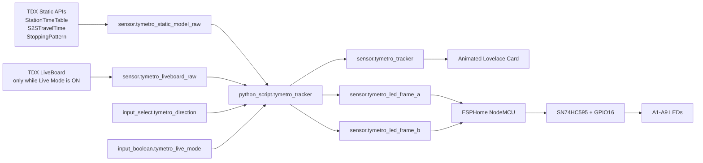

# TYMetro HA LED Tracker

A Home Assistant + ESPHome project that turns Taoyuan Airport MRT A1–A9 into a physical 9-LED train tracker, with a schedule-based motion model, optional TDX realtime correction, and an animated Lovelace dashboard.

> Current status: **schedule tracking is working end-to-end**. Realtime TDX LiveBoard correction is implemented conservatively but is still being field-validated because the TYMC upstream feed was stale during the latest test.


## What this project does

- Models Airport MRT trains between **A1 Taipei Main Station** and **A9 Linkou**.
- Uses official TDX timetable and station-to-station travel-time data as the trajectory backbone.
- Updates train positions locally every 5 seconds without repeatedly calling TDX.
- Drives a physical row of **9 red LEDs** through one SN74HC595 plus one direct ESP8266 GPIO.
- Represents between-station motion with two LED frames that alternate on the ESP8266.
- Lets the user switch the displayed direction: **toward A1** or **toward A9**.
- Offers an optional **15-minute Live Mode** that polls TDX LiveBoard every 30 seconds.
- Falls back safely to schedule mode if realtime data is stale or cannot be matched confidently.
- Provides an animated Home Assistant custom card where trains move continuously along an A1–A9 line.

## High-level architecture



See [docs/architecture.md](docs/architecture.md) for the detailed data flow and state model.

## Repository layout

```text
.
├── README.md
├── PROJECT_STATUS.md
├── SECURITY.md
├── .gitignore
├── docs/
│   ├── architecture.md
│   ├── hardware.md
│   ├── setup.md
│   ├── tdx-data.md
│   ├── troubleshooting.md
│   ├── roadmap.md
│   └── images/
│       └── dashboard-v2.png
├── home-assistant/
│   ├── configuration-snippet.yaml
│   ├── helpers.md
│   ├── python_scripts/
│   │   └── tymetro_tracker.py
│   └── automations/
│       ├── live-session-control.yaml
│       ├── tracker-engine.yaml
│       └── abort-stale-live.yaml
├── esphome/
│   ├── tymetro-led.yaml
│   └── secrets.example.yaml
└── dashboard/
    ├── tymetro-tracker-card.js
    └── view.yaml
```

## Hardware

Current prototype:

- NodeMCU v2 / ESP8266
- 1 × SN74HC595 8-bit shift register
- 9 × 5 mm red LEDs
- 9 × 330 Ω resistors
- 1 × 0.1 µF ceramic capacitor near the 74HC595
- Breadboard + jumper wires
- USB power to NodeMCU; NodeMCU 3V3/GND powers the logic and LEDs

A1–A8 are driven by the shift register. A9 is driven directly by `GPIO16 / D0`.

Full wiring: [docs/hardware.md](docs/hardware.md)

## Software requirements

- Home Assistant
- ESPHome Device Builder
- Python Script integration enabled in Home Assistant
- TDX account with Client ID / Client Secret
- A dashboard that supports custom Lovelace resources

No paid TDX plan is required for the intended low-rate polling pattern, but quota/plan details can change; check the current TDX console before deployment.

## Quick setup

1. Build and test the hardware using [docs/hardware.md](docs/hardware.md).
2. Create the three Home Assistant helpers listed in [home-assistant/helpers.md](home-assistant/helpers.md).
3. Add TDX credentials to `secrets.yaml`.
4. Merge [home-assistant/configuration-snippet.yaml](home-assistant/configuration-snippet.yaml) into your existing Home Assistant configuration.
5. Copy [home-assistant/python_scripts/tymetro_tracker.py](home-assistant/python_scripts/tymetro_tracker.py) into `/homeassistant/python_scripts/`.
6. Add the three automations from `home-assistant/automations/`.
7. Flash [esphome/tymetro-led.yaml](esphome/tymetro-led.yaml) to the NodeMCU.
8. Copy [dashboard/tymetro-tracker-card.js](dashboard/tymetro-tracker-card.js) to `/homeassistant/www/` and register it as a JavaScript module resource.
9. Add [dashboard/view.yaml](dashboard/view.yaml) to your dashboard.

Detailed instructions: [docs/setup.md](docs/setup.md)

## Runtime behavior

### Normal mode

`Live Mode = OFF`

- TDX LiveBoard is not polled.
- Static schedule data is used to simulate train movement.
- Tracker calculations run locally every 5 seconds.
- Physical LEDs and dashboard stay active continuously.

### Live mode

`Live Mode = ON`

- LiveBoard is fetched immediately and then every 30 seconds.
- A 15-minute session timer starts.
- The tracker attempts conservative schedule-to-LiveBoard matching.
- Successful matches shift the train timeline by measured early/late offsets.
- If LiveBoard is stale, the tracker remains on schedule data and a safety automation turns Live Mode off after 40 seconds.

## Tracker modes

| Mode | Meaning |
|---|---|
| `schedule` | Normal schedule simulation. |
| `schedule_live_pending` | Live Mode is on, but no trustworthy correction is available yet. |
| `live` | Realtime correction is active for at least one train. |
| `schedule_live_stale` | LiveBoard source data is too old; schedule fallback is used. |
| `unavailable` | Static model is not ready. |

## LED model

The tracker publishes two 9-bit integers:

- `sensor.tymetro_led_frame_a`
- `sensor.tymetro_led_frame_b`

Bit mapping:

```text
bit 0 = A1
bit 1 = A2
...
bit 8 = A9
```

At a station, the same bit is present in both frames. In the middle of a station-to-station segment, Frame A can show the previous station and Frame B the next station. ESPHome alternates the two frames every 600 ms.

This keeps rapid LED animation local to the ESP8266 instead of sending Home Assistant state changes every 600 ms.

## Security

Do **not** commit real credentials, API encryption keys, Wi-Fi passwords, fallback AP passwords, or TDX secrets.

Use the example files and Home Assistant/ESPHome secrets mechanisms. See [SECURITY.md](SECURITY.md).

## Known limitation

TDX `LiveBoard/TYMC` is station-centric ETA data, not a GPS train feed. It does not provide a reliable train identifier for every record. Therefore realtime positioning is implemented as a conservative correction layer over official schedule trajectories, not as direct GPS tracking.

## Project history

The project started as a breadboard proof-of-concept: first verify nine physical LEDs, then connect Home Assistant, then build schedule tracking, and finally add TDX realtime correction and an animated UI. The current design intentionally keeps the ESP8266 simple and moves network/data-model complexity into Home Assistant.
