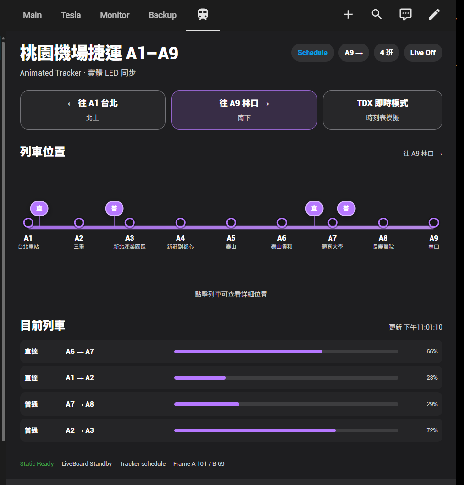
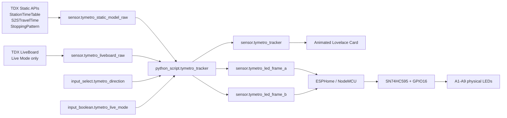

# TYMetro HA LED Tracker

A Home Assistant + ESPHome side project that turns Taoyuan Airport MRT **A1–A9** into a physical 9-LED train-position display and an animated Lovelace tracker.

> **Current status (2026-08-22):** the schedule-based tracker is working end-to-end: TDX static timetable data → Home Assistant trajectory model → animated dashboard → ESPHome → physical LEDs. Realtime TDX LiveBoard correction is implemented conservatively, but final field validation still depends on a fresh TYMC upstream feed.



## What it does

- Models trains in the **A1 Taipei Main Station ↔ A9 Linkou** section.
- Uses official TDX timetable, stopping-pattern, and station-to-station runtime data as the deterministic backbone.
- Recomputes train positions locally in Home Assistant every **5 seconds**.
- Supports **Local / Express** trajectories.
- Drives **9 physical red LEDs**:
  - A1–A8 through one `SN74HC595`
  - A9 through NodeMCU `D0 / GPIO16`
- Converts train position into two 9-bit LED frames and alternates them every **600 ms** on the ESP8266.
- Shows trains at stations as stable LEDs and station-to-station movement as temporal interpolation between adjacent LEDs.
- Supports multiple trains at once by OR-combining occupied LED bits.
- Lets the user choose the physical display direction:
  - `← 往 A1 台北`
  - `往 A9 林口 →`
- Includes a custom animated Home Assistant card with continuous train markers and compact train progress rows.
- Provides optional **15-minute Live Mode** with TDX LiveBoard polling every 30 seconds.
- Rejects stale realtime source data and falls back to schedule mode instead of displaying false “live” positions.

## System architecture



The central design decision is that **Home Assistant owns the train model** while the ESP8266 owns only the fast LED renderer. The same canonical tracker state feeds both the dashboard and physical display.

Detailed architecture: [docs/architecture.md](docs/architecture.md)

## Repository layout

```text
.
├── README.md
├── PROJECT_STATUS.md
├── CHANGELOG.md
├── SECURITY.md
├── .gitignore
├── docs/
│   ├── architecture.md
│   ├── hardware.md
│   ├── led-rendering.md
│   ├── reliability.md
│   ├── verification.md
│   ├── setup.md
│   ├── tdx-data.md
│   ├── troubleshooting.md
│   ├── roadmap.md
│   ├── public-release-checklist.md
│   └── images/
│       └── dashboard-v2.png
├── home-assistant/
│   ├── configuration-snippet.yaml
│   ├── secrets.example.yaml
│   ├── helpers.md
│   ├── python_scripts/
│   │   └── tymetro_tracker.py
│   └── automations/
│       ├── live-session-control.yaml
│       ├── tracker-engine.yaml
│       └── abort-stale-live.yaml
├── esphome/
│   ├── tymetro-led.yaml
│   └── secrets.example.yaml
├── dashboard/
│   ├── tymetro-tracker-card.js
│   └── view.yaml
└── scripts/
    └── public-safety-check.py
```

# Physical LED display

The hardware is intentionally small and reproducible:

| Part | Role |
|---|---|
| NodeMCU v2 / ESP8266 | Wi-Fi + ESPHome + frame renderer |
| SN74HC595 | Expands three GPIO control lines into 8 LED outputs |
| 9 × red LEDs | A1 through A9 station-position indicators |
| 9 × 330 Ω resistors | One current-limiting resistor per LED |
| Breadboard + jumpers | Prototype wiring |
| USB power | Powers NodeMCU; NodeMCU 3V3/GND powers the prototype |

Why one 74HC595 plus one direct GPIO? A single 74HC595 gives exactly eight outputs, so it maps naturally to **A1–A8**. The ninth LED, **A9**, uses `D0 / GPIO16` directly.

```text
NodeMCU D7 / GPIO13 ── DATA  ┐
NodeMCU D5 / GPIO14 ── CLOCK ├─> SN74HC595 ── QA..QH ──> A1..A8
NodeMCU D6 / GPIO12 ── LATCH ┘

NodeMCU D0 / GPIO16 ───────────────────────────────> A9

Every LED:
output ──> anode (long leg) ── LED ── cathode ── 330Ω ── GND
```

The verified breadboard build, exact pin mapping, station positions, IC orientation, test procedure, failure symptoms, and expansion notes are documented in **[docs/hardware.md](docs/hardware.md)**.

The LED animation semantics are documented separately in **[docs/led-rendering.md](docs/led-rendering.md)**.

## LED position semantics

The physical LEDs represent **position**, not station stopping eligibility.

For example, an Express train may physically pass A2 even if it does not stop there. The tracker therefore interpolates the Express trajectory across the A1–A9 physical station line.

Two frame integers are produced:

- `sensor.tymetro_led_frame_a`
- `sensor.tymetro_led_frame_b`

Bit mapping:

```text
bit 0 = A1
bit 1 = A2
bit 2 = A3
...
bit 8 = A9
```

Examples:

```text
A1 only                  = 1
A1 + A3 + A5 + A8        = 149
all A1-A9                = 511
```

At a station:

```text
Frame A: A5 ON
Frame B: A5 ON
```

In the middle third of A5 → A6:

```text
Frame A: A5 ON
Frame B: A6 ON
```

ESPHome alternates Frame A / B every 600 ms, creating an intuitive “between stations” indication without making Home Assistant transmit LED changes at 600 ms frequency.

## Software requirements

- Home Assistant
- ESPHome Device Builder
- Home Assistant `python_script` integration
- TDX Client ID / Client Secret
- Lovelace dashboard with JavaScript module resources enabled

The normal schedule model does **not** poll TDX every 5 seconds. Only the local tracker computation runs every 5 seconds.

## Quick setup

1. Build the physical display: [docs/hardware.md](docs/hardware.md)
2. Create the three HA helpers: [home-assistant/helpers.md](home-assistant/helpers.md)
3. Put TDX credentials in your private Home Assistant `secrets.yaml`.
4. Merge [home-assistant/configuration-snippet.yaml](home-assistant/configuration-snippet.yaml) into your HA configuration.
5. Copy [home-assistant/python_scripts/tymetro_tracker.py](home-assistant/python_scripts/tymetro_tracker.py) to `/homeassistant/python_scripts/`.
6. Add the three automations in [home-assistant/automations/](home-assistant/automations/).
7. Flash [esphome/tymetro-led.yaml](esphome/tymetro-led.yaml).
8. Copy [dashboard/tymetro-tracker-card.js](dashboard/tymetro-tracker-card.js) to `/homeassistant/www/`.
9. Register `/local/tymetro-tracker-card.js?v=2` as a JavaScript Module resource.
10. Add [dashboard/view.yaml](dashboard/view.yaml) to Lovelace.
11. Validate the end-to-end test sequence in [docs/verification.md](docs/verification.md).

Full deployment guide: [docs/setup.md](docs/setup.md)

# Runtime behavior

## Schedule mode — normal operation

`Live Mode = OFF`

- LiveBoard is not polled.
- The already-ingested official timetable model is used.
- `TYMetro - Tracker Engine` invokes `python_script.tymetro_tracker` every 5 seconds.
- The script emits train objects plus Frame A / B.
- The dashboard animates train markers between each 5-second update.
- ESPHome independently alternates Frame A / B every 600 ms.
- The physical LEDs and dashboard continue to work without manual interaction.

### Static-data dependency

Static TDX data is refreshed on Home Assistant startup and daily at 03:30. Once a valid static model is loaded, train motion is calculated locally.

A **cold start while the required TDX static APIs are unavailable** remains a reliability limitation; see [docs/reliability.md](docs/reliability.md). This is separate from the optional LiveBoard feature.

## Live mode — optional correction layer

`Live Mode = ON`

- LiveBoard is fetched immediately and every 30 seconds.
- A 15-minute timer starts.
- Schedule trajectories remain the backbone.
- Fresh LiveBoard ETA events are conservatively matched to candidate timetable events.
- A successful match applies an early/late timeline offset.
- Realtime source age greater than the configured freshness limit is rejected.
- Stale data produces `schedule_live_stale`, while the schedule display continues normally.
- A stale-abort automation is configured to turn Live Mode off after 40 seconds if stale state persists.

The realtime matcher is implemented but final fresh-feed field validation is still outstanding because the latest TYMC test feed was stale upstream.

## Tracker modes

| Mode | Meaning |
|---|---|
| `schedule` | Normal schedule simulation. |
| `schedule_live_pending` | Live requested, but no trustworthy correction is available yet. |
| `live` | At least one train has an accepted LiveBoard correction. |
| `schedule_live_stale` | LiveBoard source is too old; schedule fallback remains active. |
| `unavailable` | Required static model is not ready. |

# Verified project state

The following parts have already been exercised end-to-end:

- NodeMCU + ESPHome connectivity
- all nine LED channels
- SN74HC595 A1–A8 mapping
- GPIO16 A9 output
- All On / All Off tests
- A1 → A9 → A1 chase test
- Home Assistant Frame A / B subscription
- 600 ms local renderer
- simultaneous multi-train LED output
- direction switching
- schedule trajectory generation
- Local / Express modeling
- 5-second tracker updates
- animated custom dashboard
- LiveBoard REST ingestion
- stale-source detection and schedule fallback

See [PROJECT_STATUS.md](PROJECT_STATUS.md) and [docs/verification.md](docs/verification.md) for the exact distinction between **verified**, **configured**, and **awaiting fresh TDX validation**.

# Security / public repository

The repository is designed to be publishable **without credentials**.

Do not commit:

- TDX Client ID / Secret
- TDX access token
- ESPHome API encryption key
- Wi-Fi credentials
- ESPHome fallback AP password
- Home Assistant tokens
- private hostnames / external HA URLs if you do not want them public

See [SECURITY.md](SECURITY.md) and [docs/public-release-checklist.md](docs/public-release-checklist.md).

A small local scanner is included:

```bash
python scripts/public-safety-check.py
```

It is only a sanity check, not a substitute for reviewing Git history before changing a repository from Private to Public.

# Known limitations

1. `LiveBoard/TYMC` is station-centric ETA data, **not train GPS**.
2. LiveBoard does not always expose a reliable physical train identifier, so realtime correction is matching-based.
3. The physical prototype shows **one selected direction** at a time.
4. Multiple trains can share the same physical LED bit, so the LED display cannot show train count at a single exact position; the dashboard can.
5. Cold-start independence from TDX static APIs is not yet guaranteed.
6. The current prototype covers A1–A9 only.

# Project philosophy

The physical board is intentionally dumb and robust. OAuth, API parsing, schedule modeling, data-quality decisions, and train matching live in Home Assistant. The ESP8266 only needs to receive two tiny frame values and render them reliably.

That split keeps the hardware simple while still allowing the web dashboard to become much richer than the 9-LED display.
