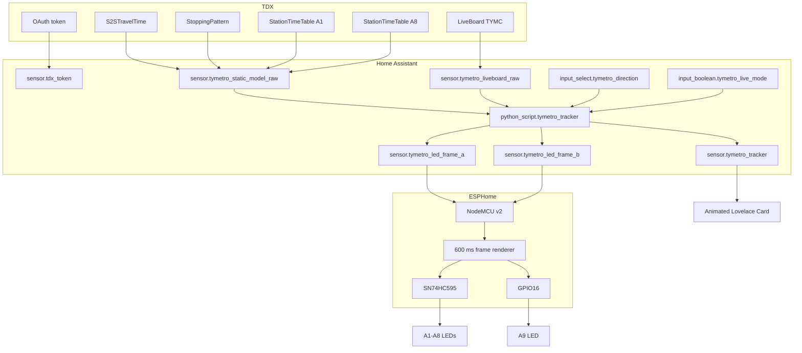

# Architecture

## Design goals

1. Keep the physical ESP8266 renderer simple and reliable.
2. Keep TDX OAuth, JSON parsing, schedule modeling, and realtime matching in Home Assistant.
3. Avoid unnecessary TDX calls in normal use.
4. Fail safely to schedule mode when realtime data is stale or ambiguous.
5. Reuse one canonical train model for both physical LEDs and the dashboard.

## Data plane



## Static model

Static data is refreshed:

- on Home Assistant startup
- every day at 03:30

Four REST commands are used:

- `S2STravelTime/TYMC`
- `StoppingPattern/TYMC`
- `StationTimeTable/TYMC` filtered to A1
- `StationTimeTable/TYMC` filtered to A8

Why A1 and A8?

- A1 is a useful anchor for trains entering the displayed A1→A9 range.
- A8 is a useful anchor for A1-bound trains and is also served by Express trains.

The resulting payloads are stored in `sensor.tymetro_static_model_raw`.

## Schedule engine

`python_script.tymetro_tracker` converts official timetable records and S2S travel times into train trajectories.

The script:

- selects the current service day
- handles trains after midnight as part of the previous operating day
- constructs Local and Express travel-time models
- determines whether each train is at a station or between two stations
- calculates a normalized segment `progress` from `0.0` to `1.0`
- creates one canonical list of train objects
- converts those objects into LED Frame A and Frame B

## Realtime correction

LiveBoard is deliberately **not** treated as GPS.

TDX LiveBoard records are station-centric ETA events. The tracker therefore:

1. builds scheduled station events for candidate trains
2. converts LiveBoard ETA records to absolute service-day times
3. matches realtime events against compatible scheduled events
4. derives early/late offsets
5. applies a median correction to the train timeline
6. refuses correction when matching is ambiguous or data is stale

Current freshness threshold in the tracker: **300 seconds** based on `SrcUpdateTime`.

## Tracker entity

`sensor.tymetro_tracker` is the canonical UI/data entity.

Important attributes:

```yaml
direction: to_a1 | to_a9
direction_label: "← 往 A1 台北" | "往 A9 林口 →"
mode: schedule | schedule_live_pending | live | schedule_live_stale
live_requested: true | false
live_correction_active: true | false
live_source_update: ISO8601 timestamp
live_source_age_seconds: integer
live_match_count: integer
live_matched_event_count: integer
corrected_train_count: integer
service_day: Monday ... Sunday
updated_at: ISO8601 timestamp
train_count: integer
frame_a: 0..511
frame_b: 0..511
trains: [...]
```

Typical train object:

```yaml
key: "N|22:24|A1|1|SP1"
type: local
train_type: 1
pattern: SP1
destination: A1
state: between
station: ""
from: A6
to: A5
progress: 0.889
anchor: "22:28"
live_corrected: false
delay_seconds: 0
delay_minutes: 0
```

## LED frame model

Each frame is a 9-bit integer.

```text
A1 A2 A3 A4 A5 A6 A7 A8 A9
b0 b1 b2 b3 b4 b5 b6 b7 b8
```

Examples:

- A1 only: `1`
- A1 + A3 + A5 + A8: `149`
- all nine: `511`

Station representation:

```text
Frame A: A5 ON
Frame B: A5 ON
```

Between-station middle representation A5→A6:

```text
Frame A: A5 ON
Frame B: A6 ON
```

The ESP8266 alternates these frames every 600 ms. This is intentionally local animation: Home Assistant sends only updated frame integers.

## Why direction is a user-selectable mode

The physical prototype has only one row of nine LEDs. Showing both directions simultaneously would make the display ambiguous, so `input_select.tymetro_direction` chooses the direction represented on the physical board.

The dashboard can later evolve beyond this hardware limitation.
